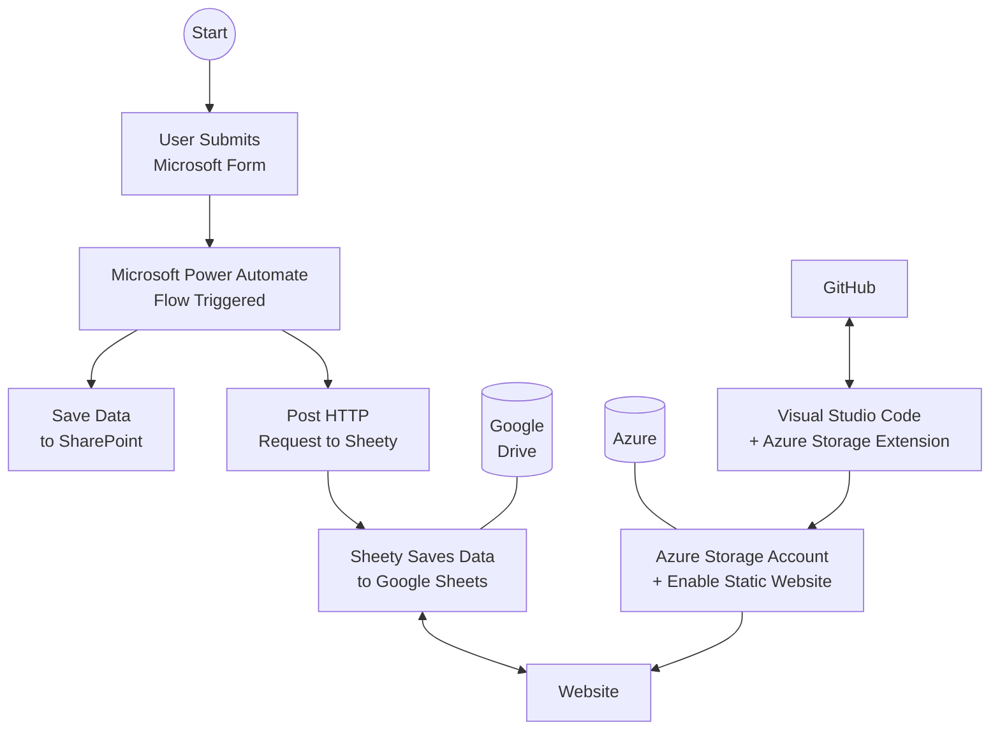

```mermaid
flowchart TB
    A(("Start")) --> B["User Submits<br>Microsoft Form"]
    B --> C["Microsoft Power Automate<br>Flow Triggered"]
    C --> D["Save Data<br>to SharePoint"] & E["Post HTTP<br>Request to Sheety"]
    G["Sheety Saves Data<br>to Google Sheets"] <--> n3["Website"]
    E --> G
    n5["Azure"] --- n6["Azure Storage Account<br>+ Enable Static Website"]
    n6 --> n3
    n9["GitHub"] <--> n7["Visual Studio Code <br>+ Azure Storage Extension"]
    n7 --> n6
    n10["Google <br>Drive"] --- G
    n5@{ shape: cyl}
    n7@{ shape: rect}
    n10@{ shape: cyl}
```

```mermaid
  graph TD;
      A-->B;
      A-->C;
      B-->D;
      C-->D;
```