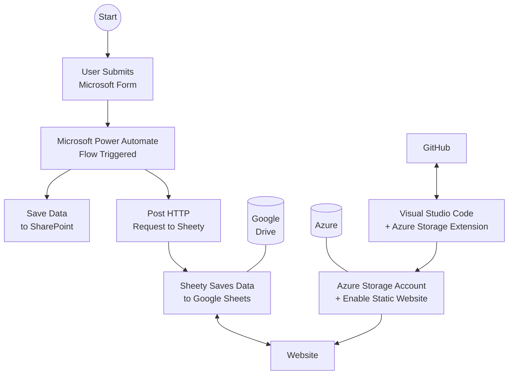

# Employee Roster

This is a simple website that shows employee office availablily by week and by location. 

## Services used 

* Microsoft Form  
* Microsoft Power Automate 
* [Sheety.co](https://sheety.co/)
* Generative AI (ChatGPT) to create the website in Javascript

## Learnings 

* Flowcharts can be created from code easily using the `mermaid` language they can be even rendered in a markdown document such as this one. There's also a powerful web-based editor called [**Mermaid Playground**](https://www.mermaidchart.com/play). 
* **Azure Storage Account** (blob) supports web hosting of static websites for very little cost (less than £1 per month)
* **Visual Studio Code** can be used to deploy the website directly to Azure using the free [**Azure Storage** extension](https://github.com/microsoft/vscode-azurestorage). 

## Flowchart

This flowchart illustrates the data flow through various tools and services. 

